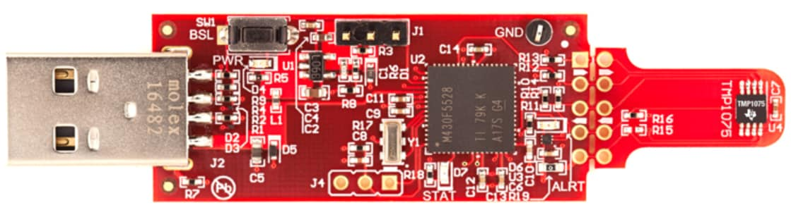
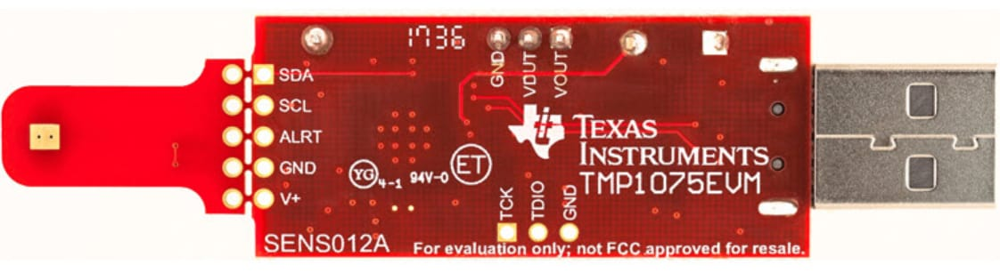
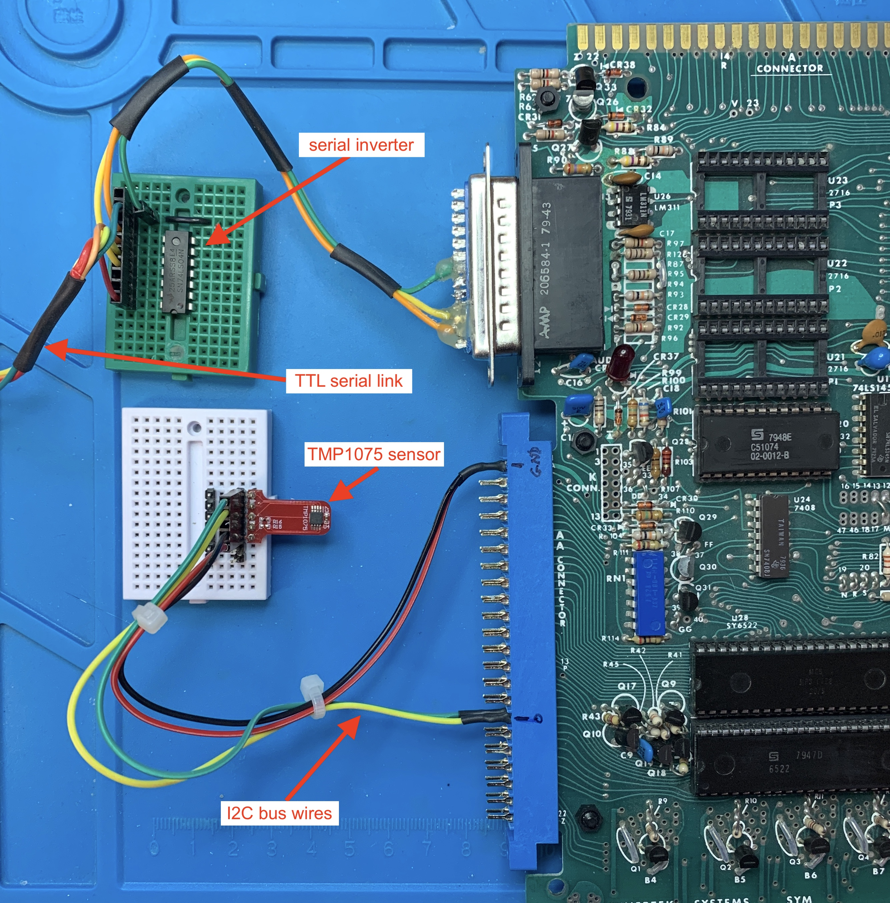
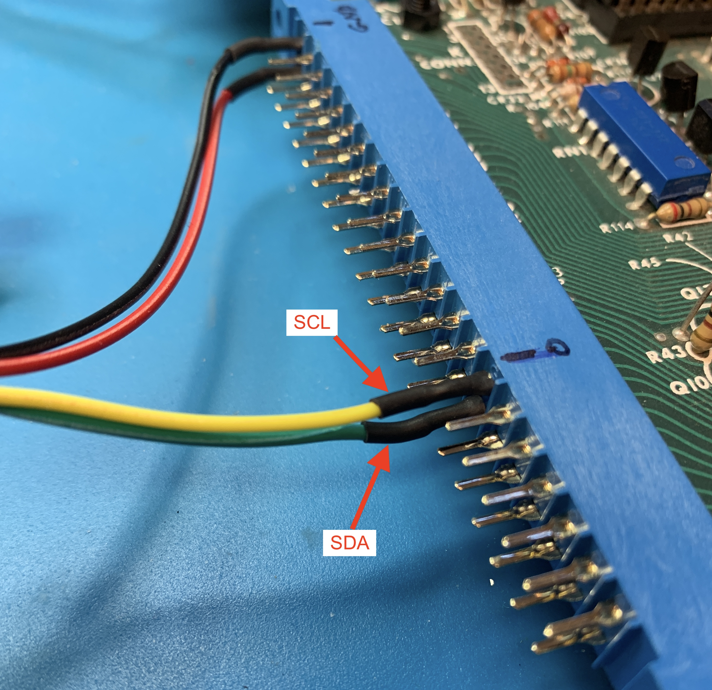
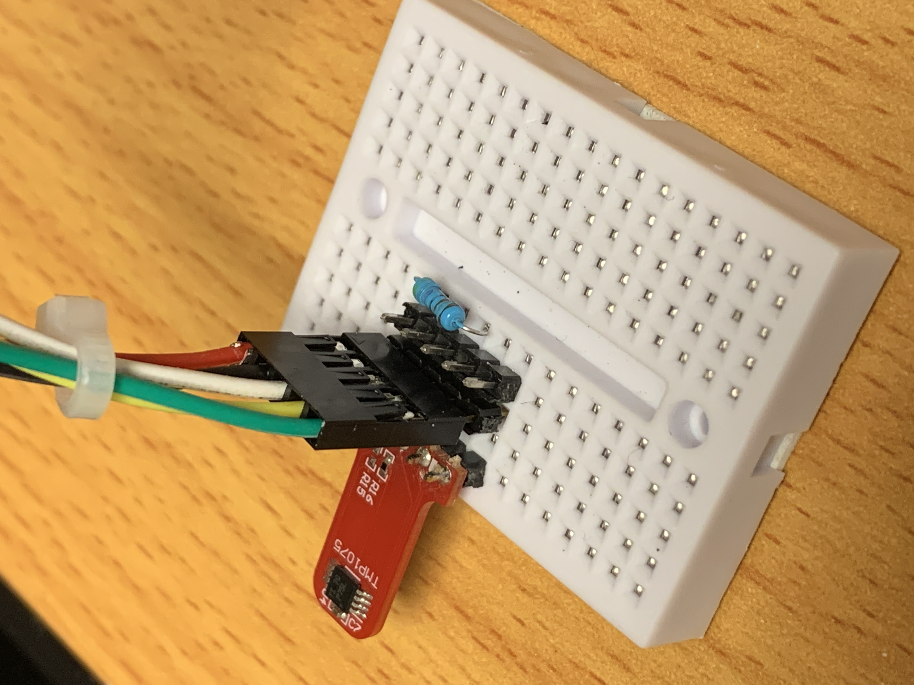

# SYM-1 I2C Sensor -- A Simple TMP1075 Temperature Demo

## Overview
This project produces a simple I2C driver which connects the TMP1075 temperature sensor to the SYM-1 board.  
The general operation is rather simple; showing a simple I2C implemntation via bit-banging functions.  
As a secondary goal, this project shows how to construct firmware from C and assembly files.  

## Requirements
1) Functioning SYM-1 board with at least 4K of RAM
2) Latest installation of the CC65 toolchain (NOTE: latest is quit old)
3) An 44-line edge connector (for connector "AA" on SYM-1. (or an IO-Expansion board)
4) Other standard development tools: make, editor, hexdump, etc.
5) Access to a terminal emulation program such as minicom (used for this development).

### Using the TMP1075EVM Eval Module

  

Snap-off the sensor portion of the eval board and solder a standard 0.1" header onto it.  
The USB-side is put aside and not used in this project, but keep it.  
At the time of this projects creation, the TMP1075EVM is about $24.  

### Build a TMP1075 Sensor from Parts
Alternatively, a TMP1075 sensor module could be build from scratch.  
At the time of this project's creation, the TMP1075 IC is about $0.50.  
**Warning:** The pitch on this IC is very fine and can be challenging to solder.  
As the eval module sensor was used in this project, no further details will be given here.  

## Hardware Configuration
Below are photos showing the hardware configuration.  



Here is a close-up of the I2C bus wires connected to the edge connector.  



Here is a close-up of the TMP1075 device wiring details. 

  

A 4.7K pull-up resistor is needed between Vcc and ALERT.  
```
  TMP1075 ALERT ────┬── VIA3 CA1 ("P" on AA-Connector)
                    └── 4.7kΩ pull-up to Vcc
```

The I2C bus will be conducted on VIA-3 (6522) at address base __$AC00__.  
The __SDA__ line will be on __$AC00 B0__ (on AA-Connector "16")  
The __SCL__ line will be on __$AC00 B1__ (on AA-Connector "T")  

## How to Build the Firmware

This build method use standard make
1) cd to the _SYM1_I2C_Sensor_ directory
2) _./build.sh_

This will produce both _tmp1075.bin_ and _tmp1075.out_ files  

An example build output is shown below.  
```
~/sym1/cc65/bin/cc65 -t sym1 -O main.c 
~/sym1/cc65/bin/ca65 --cpu 6502 -l main.lst main.s -o main.o 
~/sym1/cc65/bin/ca65 --cpu 6502 -l i2c.lst i2c.s -o i2c.o 
~/sym1/cc65/bin/ca65 --cpu 6502 -l interrupts.lst interrupts.s -o interrupts.o 
~/sym1/cc65/bin/ld65 -t sym1 main.o i2c.o interrupts.o -o tmp1075.bin --lib sym1.lib	
hexdump -v -e '1/1 "%02x\n"' tmp1075.bin > tmp1075.out
```

## How to Load the Firmware onto the SYM-1.
It is assume you already have an serial link connection and can get the dot prompt (.) on your terminal emulator (minicom).  
Be sure that your terminal emulator is running at __4800 baud 8N1__. 

Assuming you're using minicom, you will need to set delays for each character and newline.  
Press the __CTRL-A__ key + __T__ key to envoke the _Terminal settings_ menu, as shown below.  
Press the __D__ key and enter __25__ [ENTER]  
Press the __F__ key and enter __5__ [ENTER]  

```
Press CTRL-A Z+---------------[Terminal settings]----------------+
              |                                                  |
              | A -      Terminal emulation : VT102              |
              | B -     Backspace key sends : BS                 |
              | C -          Status line is : enabled            |
              | D -   Newline tx delay (ms) : 25                 |
              | E -          ENQ answerback : Minicom2.9         |
              | F - Character tx delay (ms) : 5                  |
              |    Change which setting?                         |
              |                                                  |
              +--------------------------------------------------+
```
  
Open the tmp1075.out file in a standard text editor (gedit).
You will notice that the file contents is a series of one-byte lines.
Select the full content with __CTRL-a__ and then __CTRL-c__ to copy it into your copy&paste buffer.  

Back on the terminal emulator, enter the load-point address 
```
.m 200
0200,7B,
```
Now __CTRL-v__ to paste the contents as held in the copy&paste buffer.  
This will stream in the contents fo the _tmp1075.out_ file.  
This will take several minutes - usually about 2 minutes.

### Example of Firmware Loading
The listing below shows loading the firmware at memory location 0x200.  

```
Welcome to minicom 2.7.1

OPTIONS: 
Compiled on Oct  6 2019, 23:16:03.
Port /dev/tty.usbserial-00000000, 14:55:16

Press Meta-Z for help on special keys
.
.m 200
0200,7B,20        <-- CNTL-v contents of tmp1075.out here
0201,BD,86
0202,8B,8b
0203,B2,d8
0204,1B,ad
0205,B4,53
..........
..........
..........
..........
0D70,BF,00
0D71,BF,00
0D72,D9,83
0D73,DC,0b
0D74,DF,00
0D75,F9,00
0D76,95,00
0D77,9B,00
0D78,18,
.
```
### Starting the Program
At the dot prompt, enter the "g" (GO) command with 200.  
This will execute the program, as shown below.  
```
.g 200
Built Dec 16 2025 23:15:51
llim: 75.0C
hlim: 80.0C
temp: 22.6C
cfg: 0x2FF
llim: 25.0C
hlim: 30.0C
```

### Triggering Events
After starting the program, apply some heat source (hot-air gun) to the TMP1075: don't get it too close and melt things.  
The default temperature ranges, set by the program, is between 25C (low threshold) and 30C (high threshold).  
After applying some heat, you should see a temperature value printed, due to the temperature rising above the high temperature threshold value.  
Let the sensor cool a minute or so and you should see the second temperature value printed, due to the temperature falling below the lower threshold value.  
```
temp: 30.6C
temp: 24.93C
```

## Logic Analyzer Traces


 
 

