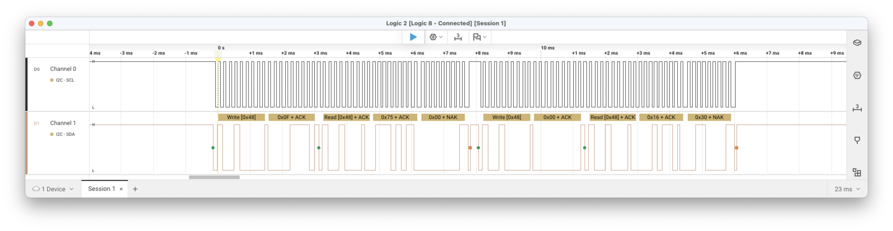
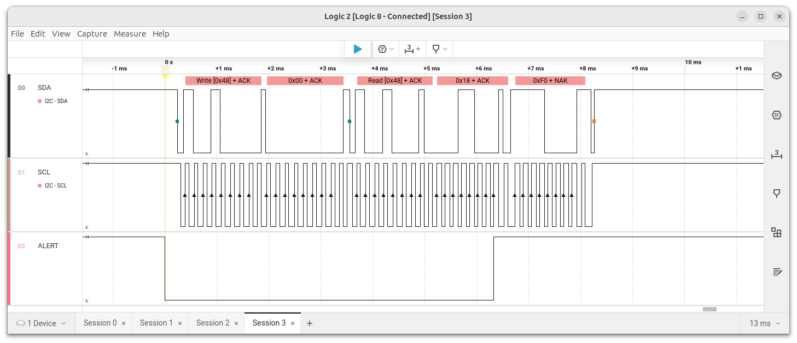

# SYM-1 I2C Sensor -- A Simple TMP1075 Temperature Demo

## Overview
This project produces a simple I2C driver which connects the TMP1075 temperature sensor to the SYM-1 board.  
The general operation is rather simple; showing a simple I2C implemntation via bit-banging functions.  
As a secondary goal, this project shows how to construct firmware from C and assembly files.  

## Requirements
1) Functioning SYM-1 board
2) Recent installation of the CC65 toolchain
3) An 44-line edge connector (for connector "AA" on SYM-1.
4) Other standard development tools: make, editor, hexdump, etc.
5) Access to a terminal emulation program such as minicom (used for this development).

## Hardware Configuration
Below are photos showing the hardware configuration.  


Here is a close-up of the I2C bus wires connected to the edge connector.  

  

A 4.7K pull-up resistor is needed between Vcc and ALERT.  
```
  TMP1075 ALERT ────┬── VIA3 CA1 ("P" on AA-Connector)
                    └── 4.7kΩ pull-up to VDD
```

The I2C bus will be conducted on VIA (6522) at address base __$AC00__.  
The __SDA__ line will be on __$AC00 B0__.  
The __SCL__ line will be on __$AC00 B1__.  

## How to Build the Firmware

This build method use standard make
1) cd to your _sym1-examples_ directory
2) cd to the _tmp1075_ directory
3) _./build.sh_

This will produce both _tmp1075.bin_ and _tmp1075.out_ files

## How to Load the Firmware onto the SYM-1.
It is assume you already have an serial link connection and can get the dot prompt (.) on your terminal emulator (minicom).  
Be sure that your terminal emulator is running at __4800 baud 8N1__. 

Assuming you're using minicom, you will need to set delays for each character and newline.  
Press the __CTRL-A__ key + __T__ key to envoke the _Terminal settings_ menu, as shown below.  
Press the __D__ key and enter __25__ [ENTER]  
Press the __F__ key and enter __5__ [ENTER]  

```
Press CTRL-A Z+---------------[Terminal settings]----------------+
              |                                                  |
              | A -      Terminal emulation : VT102              |
              | B -     Backspace key sends : BS                 |
              | C -          Status line is : enabled            |
              | D -   Newline tx delay (ms) : 25                 |
              | E -          ENQ answerback : Minicom2.9         |
              | F - Character tx delay (ms) : 5                  |
              |    Change which setting?                         |
              |                                                  |
              +--------------------------------------------------+
```
  
Open the tmp1075.out file in a standard text editor (gedit).
You will notice that the file contents is a series of one-byte lines.
Select the full content with __CTRL-a__ and then __CTRL-c__ to copy it into your copy&paste buffer.  

Back on the terminal emulator, enter the load-point address 
```
.m 200
0200,7B,
```
Now __CTRL-v__ to paste the contents as held in the copy&paste buffer.  
This will stream in the contents fo the _tmp1075.out_ file.  
This will take several minutes - usually about 2 minutes.

### Example of Firmware Loading
The listing below shows loading the firmware at memory location 0x200.  

```
Welcome to minicom 2.7.1

OPTIONS: 
Compiled on Oct  6 2019, 23:16:03.
Port /dev/tty.usbserial-00000000, 14:55:16

Press Meta-Z for help on special keys
.
.m 200
0200,7B,20        <-- CNTL-v contents of tmp1075.out here
0201,BD,86
0202,8B,8b
0203,B2,d8
0204,1B,ad
0205,B4,53
..........
..........
..........
..........
0D70,BF,00
0D71,BF,00
0D72,D9,83
0D73,DC,0b
0D74,DF,00
0D75,F9,00
0D76,95,00
0D77,9B,00
0D78,18,
.
.
.g 200
Built Dec 16 2025 23:15:51
llim: 75.0C
hlim: 80.0C
temp: 22.6C
cfg: 0x2FF
llim: 25.0C
hlim: 30.0C

temp: 30.6C
temp: 24.93C
```

## Logic Analyzer Trace



 
 

